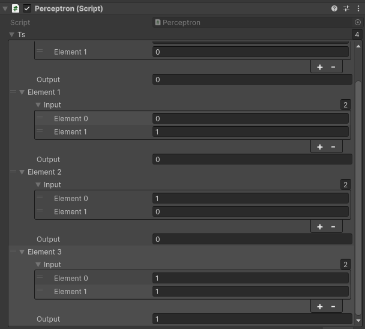

# Анализ данных в разработке игр
Отчет по лабораторной работе #4 выполнил:
- Мурашов Сергей Алексеевич
- НМТ-233004

## Отметка о выполнении заданий
| Задание   | Выполнение | Баллы |
| --------- | ---------- | ----- |
| Задание 1 | *          | 60    |
| Задание 2 | *          | 20    |
| Задание 3 | *          | 20    |

Знак "*" - задание выполнено; знак "#" - задание не выполнено;

## Работу проверили
- к.т.н., доцент Денисов Д.В.
- к.э.н., доцент Панов М.А.
- ст. преп., Фадеев В.О.

## Структура отчета
- Данные о работе: название работы, фио, группа, выполненные задания.
- Цель работы.
- Задание 1.
- Задание 2.
- Задание 3.
- Выводы.

## Цель работы
На практике изучить принцип работы перцептрон и реализовать перцептрон для некоторых логических операций.

### Задание 1
Задание В проекте Unity реализовать перцептрон, который умеет производить вычисления:
- OR.
- AND.
- NAND.
- XOR.
  
И дать комментарии о корректности работы.  
Ход работы:
- Подключить перцептрон.
- Реализовать логическую операцию OR и дать комментарии о корректности работы.
- Реализовать логическую операцию AND и дать комментарии о корректности работы.
- Реализовать логическую операцию NAND и дать комментарии о корректности работы.
- Реализовать логическую операцию XOR и дать комментарии о корректности работы.

#### OR
  
  
Для 4-х эпох количество ошибок зачастую равно 0. Для 3 эпох количество ошибок одинаково часто принимает значения 0, 1 и 2. Поэтому оптимальное количество эпох = 4.

#### AND
  
  
Всё сказанное про OR справедливо и для AND. Оптимальное количество эпох = 4.

#### NAND
  
  
Для 4-х эпох количество ошибок редко получается меньше 2. Для 6 эпох количество эпох зачастую = 0. Логично попробовать промежуточное значение, 5 эпох. Для такого количество эпох, количество ошибок принимает значения 0, 1, 2. Оптимальное количество эпох = 6.

#### XOR
  
  
Изменя количество эпох от 4 до 20, количество ошибок редко было меньше 4. Из чего можно сделать вывод, что перцептрон не подходит для реализации XOR.

### Задание 2
Задание: Построить график зависимости количества эпох от ошибок обучения. Указать от чего зависит необходимое количество эпох обучения.  
Ход работы:
- Собрать данные по количеству ошибок в зависимости от количества эпох.
- Визуализировать собранные данные в виде графика.
- Сделать вывод.

  
Оптимальное количество эпох для различных логических элементов подтвердилось +-1. Также подтвердилось, что перцептрон не подходит для реализации XOR. Необходимое количество эпох зависит от желаемой точности.

### Задание 3
Задание: Построить визуальную модель работы перцептрона на сцене Unity.  
Ход работы:
- Доработать скрипт, чтобы цвет объекта зависел от работы перцептрона.
- Разместить на сцене объект и триггер.
- Запустить модель при разном количестве эпох.

Будем строить визуальную модель работы перцептрона на реализации OR. Изменим скрипт так, чтобы после обучения перцептрон вычислял значение при входных параметрах (0, 0) и записывал его в переменную result. Далее на основе этой переменной будем менять цвет объекту при прохождении через триггер. Если перцептрон вычислил правильное значение, то изменим цвет куба на белый, иначе на чёрный.  

Рассмотрим сцену в начальный момент времени  
  
1. Объект, который падает вниз проходя через триггер и меня свой цвет с красного на черный/белый.
2. Сам триггер.
3. Плоскость на которую упадёт объект.

Запустим сцену, предварительно изменив количество эпох на 6, чтобы практически гарантировать себе правильный результат.
  
Как мы видим цвет поменялся на белый, значит обучение прошло успешно.

Изменим количество эпох на 1 и повторим опыт.
  
Закономерно объект изменил свой цвет на черный.

## Выводы
- Научился реализовать перцептрон, который умеет производить простейшие вычисления.
- Собрал и проанализировал данные по количеству ошибок в зависимости от количества эпох.
- Реализовал перцептрон в относительно реальной задаче.